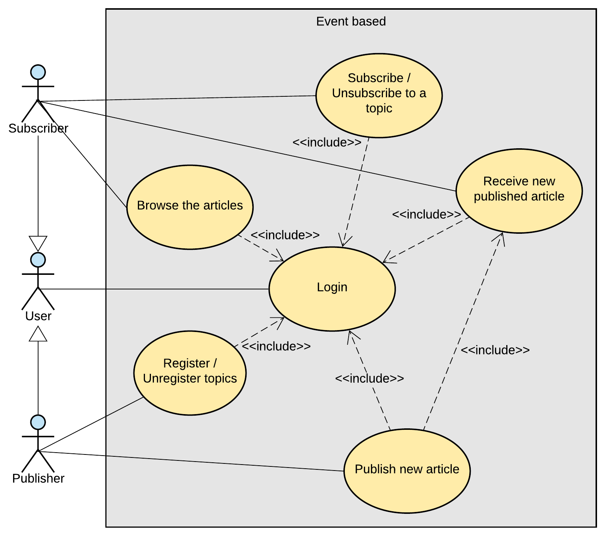
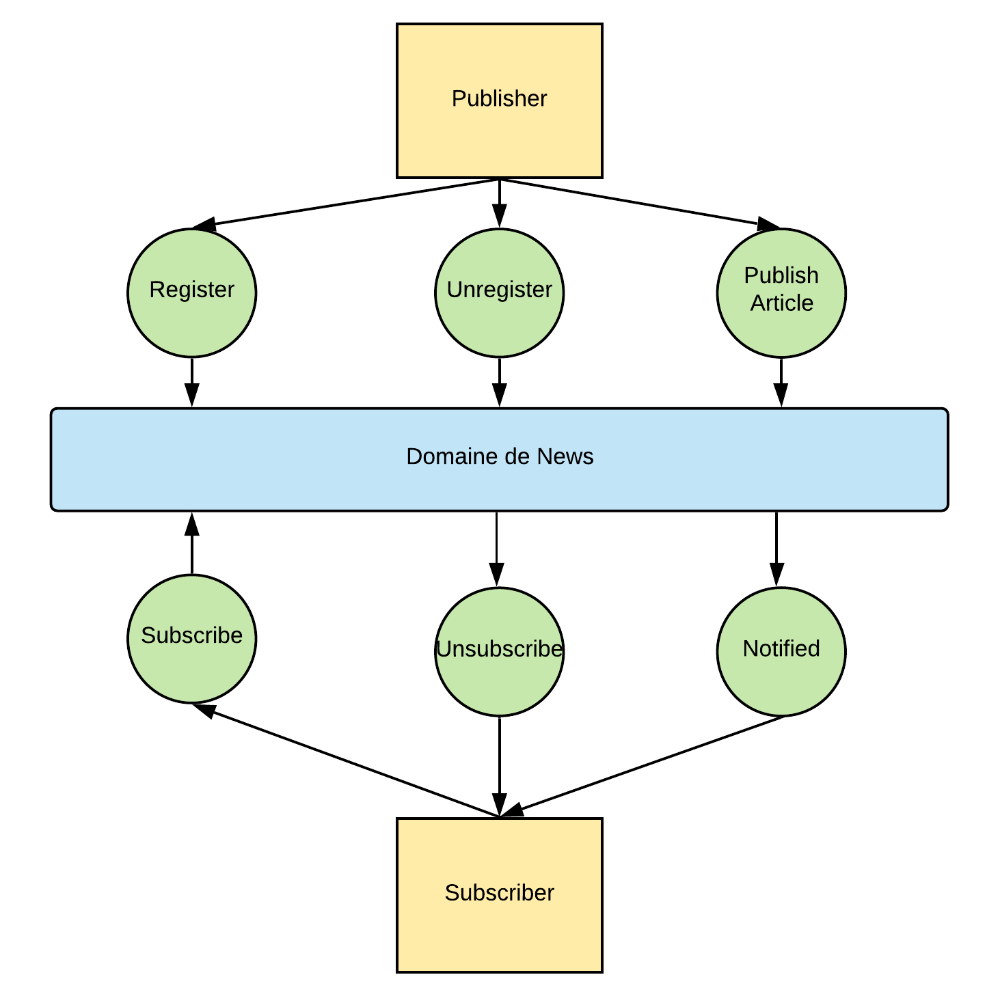
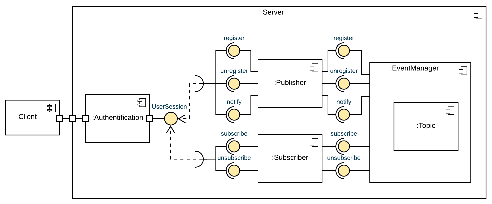
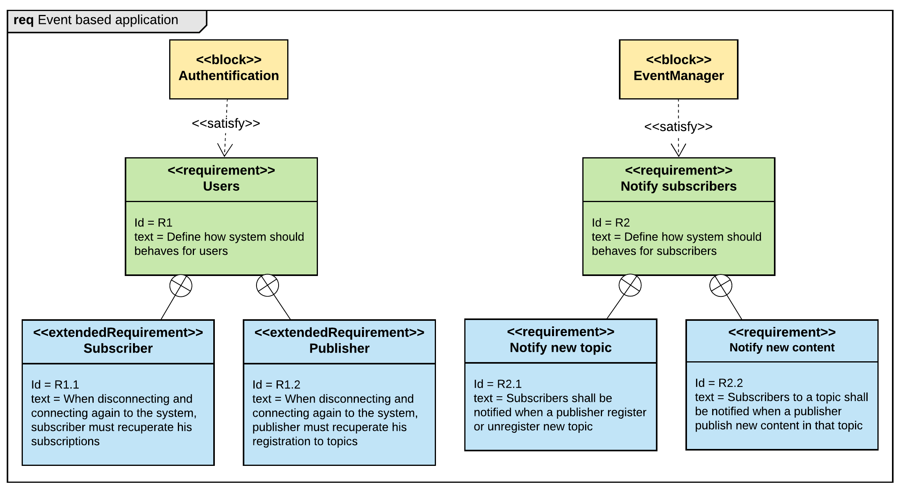
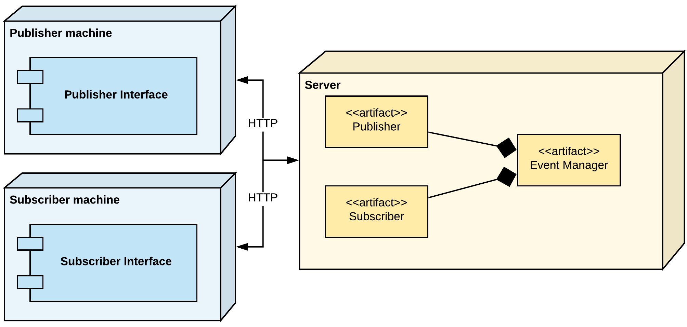
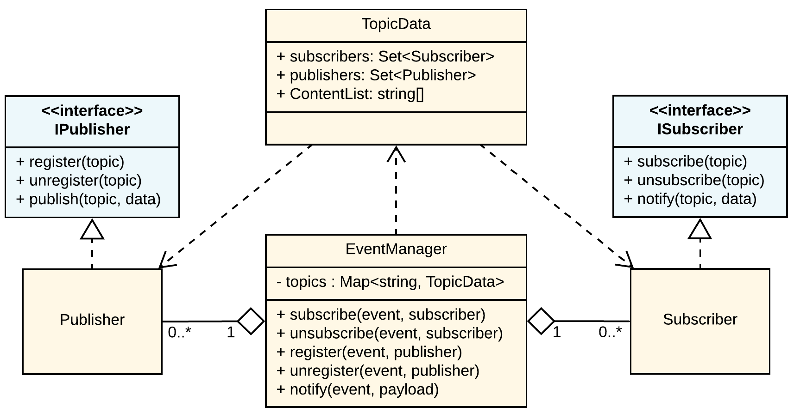
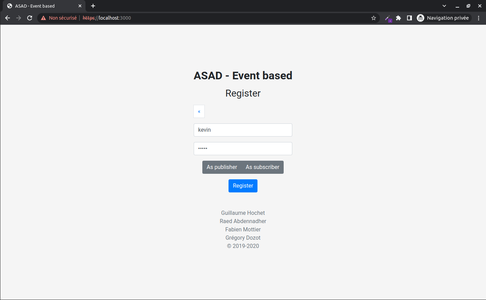
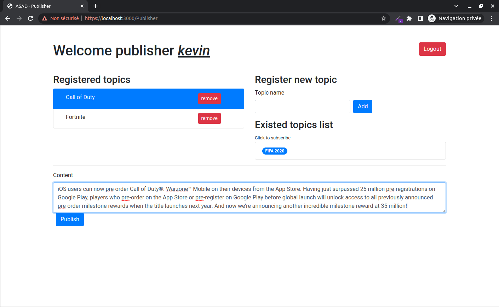
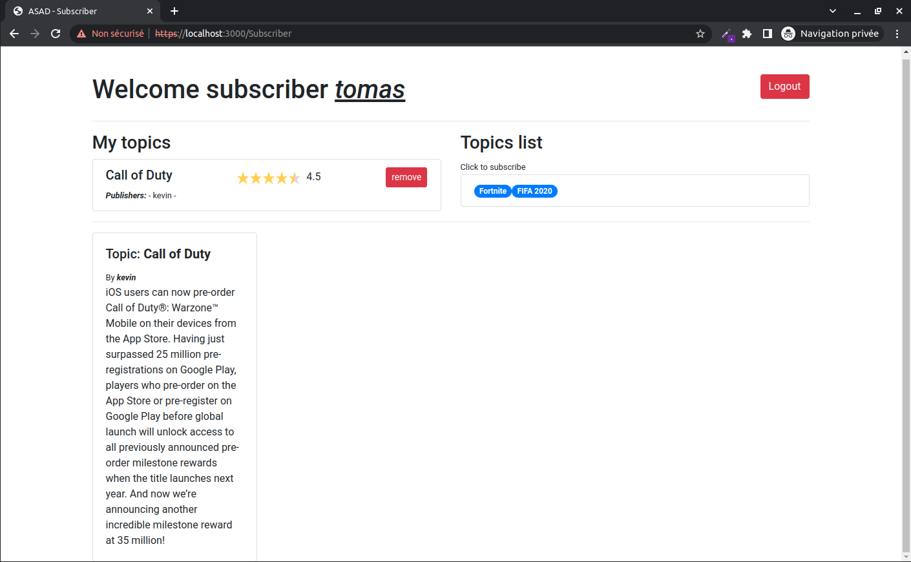

# ASAD-Event-Based-Project
Project for Advanced Software Architecture and Design (ASAD) HES-SO Master course

## How to use

### Install dependencies

```shell
npm install
```

### Run

```shell
npm start
```

Application is available on port `3000`

## Doc

> Grégory Dozot – Raed Abdennadher – Guillaume Hochet – Fabien Mottier
> Avril 2020

### 	1 Introduction

#### Cahier des charges

Dans ce projet, notre but est de concevoir une application permettant de publier et lire des informations sur des sujets intéressant l’utilisateur. Pour être informé et recevoir les nouveaux articles, un utilisateur doit s’abonner à un type d’article (comme le type politique ou économique). Une fois abonnée, l’utilisateur est notifié lorsqu’un nouvel article est mis en ligne et il peut le lire.

Les personnes publiant des articles doivent être eux aussi abonnés au type d’article afin de pouvoir publier. S’il venait à se désabonner, une notification doit être envoyée aux utilisateurs afin qu’ils sachent qu’un éditeur ne publie plus.

### 2 Analyse

Pour mettre au point cette application, nous avons opté pour une approche top-down. 

#### 2.1 Diagramme de cas d’utilisation



Comme nous pouvons le voir, il y a deux types d’utilisateurs dans notre solution. Le « Subscriber » qui s’abonne ou se désabonne et qui peut aussi lire des articles. Le « Publisher » lui peut aussi s’abonner ou se désabonner mais en lieu et place de pouvoir lire des articles, il peut lui, les publier.

#### 2.2 DFD de niveau 1

Durant notre seconde étape d’analyse, nous avons cherché à connaître les flux de données dans l’application. Nous avons donc défini un DFD de niveau 1.



Comme on peut le constater, toutes les données transitent par le « domaine de news ».

#### 2.3 Diagramme de composants

Afin de pouvoir définir correctement nos classes, nous avions besoin connaître les composants de notre système. Pour ce faire, nous avons défini un diagramme de composant.



#### 2.4 Diagramme de Requirements

A ce stade, nous avions une bonne vue d’ensemble de notre application, nous savions comment les différents éléments allaient communiquer et s’ordonnancer. Il nous fallait maintenant prendre en compte les contraintes autour de notre produit. Pour ce faire, nous avons définis un diagramme de requirement.



On constate que les contraintes sont surtout orientées autour de la notification à l’utilisateur en cas de changement dans le système.

#### 2.5 Diagramme de déploiement

Nous savons maintenant les composants dont nous avons besoin mais une question importante se pose, où se trouve ces composants. Pour le savoir, nous avons définis un diagramme de déploiement.



Ce qu’on peut noter est que toute l’intelligence est laissée au serveur. Les postes clients ne servent qu’à l’affichage et à la transmission de requête.

#### 2.6 Diagramme de classes

Finalement, nous avons fait un diagramme de classe reflétant l’architecture de notre projet.



Avec cela, nous avons pu commencer à coder l’application en étant sûr de n'avoir rien oublié concernant la structure et le rendu escompté.

### 3 Technologie

|                             Desc                             |  Language  |                             |
| :----------------------------------------------------------: | :--------: | :-------------------------: |
|              Langage de programmation utilisée               | TypeScript |         |
|                     Plateforme utilisée                      |  Node.js   |    |
| Librairie utilisée pour la gestion de communication temps-réel | socket.io  |  |
|                      Framework frontend                      |   Vue.js   |     |

### 4 Implémentation

#### 4.1 Backend

Le backend de cette application est un serveur Node.js qui écoute sur le port **3000** et qui joue à la fois le rôle d’un serveur web (gestion de routage et gestion d’authentification simplifiée) et d’un serveur **socket.io** pour gérer la communication entre les utilisateurs en temps-réel (Publishers et Subscribers)

##### 4.1.1 Serveur web

Le serveur garantit le routage des requêtes utilisateur et de servir les fichiers statiques (html, css…) utilisant le package **express**. 5 routes sont définiees :

```
[GET] /
```

Permet de servir la page d’authentification **index.html**

```
[POST] /login/:username
```

Permet à l’utilisateur de se connecter en passant en paramètre son nom. Si le **username** n’existe pas, une erreur est renvoyée

```
[POST] /register/:userType/:username
```

Permet à l’utilisateur de créer un compte en passant en paramètres son nom, et le type du compte qu’il veut créer : **publisher** ou **subscriber**. Si le **username** existe déjà, une erreur est renvoyée. Sinon, un nouvel utilisateur est créé

```
[GET] /subscriber?username=[username]
```

Si le **username** existe, cette route va servir la page d’accueil **subscriber.html** pour un Subscriber. Sinon, une redirection vers la page d’authentification sera exécutée

```
[GET] /publisher?username=[username]
```

Si le **username** existe, cette route va servir la page d’accueil **publisher.html** pour un Publisher. Sinon, une redirection vers la page d’authentification sera exécutée

##### 4.1.2 Serveur socket.io

Quand une des pages **publisher.html** et **subscriber.html** est servie, le client est automatiquement connecté au serveur socket.io, et l’évènement de connexion **connection** est déclenché. Ensuite, si c’est un Subscriber, alors l’évènement **subscriber** est déclenché, sinon c’est l’évènement **publisher** qui est déclenché. **socket.io** prévoit un mécanisme d’acquittement **ack** permettant de renvoyer des données au client après le déclanchement des évènements. La gestion de ces évènements est gérée dans le fichier **index.ts** qui représente le point d’entrée de notre application.

- Dans le cas d’un subscriber, le serveur renvoie dans l’acquittement la liste des topics dans le système, les topics auxquels il est abonné, ainsi que leurs publications.
- Dans le cas d’un publisher, le serveur renvoie dans l’acquittement la liste des topics qui existent dans le système et la liste des topics auxquels il est inscrit.

*Extraits de code 1 – Les évènements **connection**, **publisher** et **subscriber** et le renvoie des acquittements via la fonction **ack***

```typescript
io.on("connection", (socket) => {
  const username = socket.handshake.query.username;

  socket.on("subscriber", (_, ack) => {
    const subscriber = users.get(username)! as Subscriber;
    const topics: {
      topic: string, 
      publishers: string[]
    }[] = subscriber.getSubscriberTopics();
    const articles = topics.flatMap(
      (topic) => pubsub.getContentList(topic.topic).map(
        (content) => ({ topic: topic.topic, content })
      )
    );
    const allTopics = pubsub.getAllTopicList();
    ack({ topics: topics, articles: articles, allTopics: allTopics });
    
    // Other events listeners here
  });

  socket.on("publisher", (_, ack) => {
    const publisher = users.get(username)! as Publisher;
    const topics = publisher.getPublisherTopics();
    const allTopics = pubsub.getAllTopicList();
    ack({ topics: topics, allTopics: allTopics });

    // Other events listeners here
  });
});
```

Evènements déclenchés pour un Subscriber :

- **subscriber** : permet de s’abonner à un topic
- **unsubscribe** : permet de se désabonner à un topic

*Extraits de code 2 - Les évènements **subscribe** et **unsubscribe***

```typescript
socket.on("subscriber", (_, ack) => {
  ...
  socket.on("subscribe", (topic, ack) => {
    subscriber.subscribe(topic);
    ...
  });

  socket.on("unsubscribe", (topic) => {
    subscriber.unsubscribe(topic);
  });
});
```

Evènements déclenchés pour un Sublisher :

- **register** : permet de s’inscrire à un topic pour pouvoir y publier du contenu.
- **unregister** : permet de se désinscrire à un topic.
- **publish** : permet de publier du contenu dans un topic

Au moment de l’inscription ou la désinscription d’un publisher à un topic, le serveur invoque les évènements **topicRegistered** ou **topicUnregistered** respectivement pour être déclenchés chez tous les subscribers connectés.

*Extraits de code 3 – Les évènements **register**, **unregister** et **publish***

```typescript
socket.on("publisher", (_, ack) => {
  ...
  socket.on("register", (topic) => {
    publisher.register(topic);
    // send notification with the new topic to all connected users
    io.emit("topicRegistered", topic, publisher.username);
  });

  socket.on("unregister", (topic) => {
    publisher.unregister(topic);
    // send notification with the unregistered topic to all connected users
    io.emit("topicUnregistered", topic, publisher.username);
  });

  socket.on("publish", (topic, text) => {
    publisher.publish(topic, text);
  });
});
```

Remarque : `socket.emit(event, data)` permet de déclencher l’évènement chez un client particulier connecté. Alors que `io.emit(event, data)` permet de déclencher l’évènement chez tous les clients connectés.

##### 4.1.3 La gestion des évènements EventManager

Ce composant est représenté sous forme de classe responsable de la gestion des évènements :

- L’attribut **topics** est une **Map** (avec le topic comme clé, et ses informations comme valeur) permettant de garder en mémoire les différents topics du système :

  *Extraits de code 4 - Définition de l'attribut **topics***

  ```typescript
  interface ITopicData {
    publishers: Set<Publisher>;
    subscribers: Set<Subscriber>;
    contentList: {text: string, publisher: string}[];
  };
  
  class EventManager {
    private topics: Map<string, ITopicData> = new Map();
    ...
  }
  ```

- La logique des méthodes de cette classes tourne autour de cet attribut **topic**. La liste suivante est une liste non exclusive des méthodes de cette classe :

  - **subscribe** : ajoute un subscriber à un topic

    *Extraits de code 5 - La méthode **subscribe** de **EventManager***

    ```typescript
    subscribe(topic: string, subscriber: Subscriber) {
      this.getTopicData(topic).subscribers.add(subscriber);
    }
    ```

  - **unsubscribe** : supprime un subscriber à un topic

    *Extraits de code 6 - La méthode **unsubscribe** de **EventManager***

    ```typescript
    unsubscribe(topic: string, subscriber: Subscriber) {
      this.getTopicData(topic).subscribers.delete(subscriber);
    }
    ```

  - **register** : inscrit un publisher à un topic. Si le topic n’existe pas, un nouveau est créé

    *Extraits de code 7 - La màthode **register** de **EventManager***

    ```typescript
    register(topic: string, publisher: Publisher) {
      this.registerTopic(topic);
      this.getTopicData(topic).publishers.add(publisher);
    }
    
    private registerTopic(topic: string) {
      if (!this.topics.has(topic)) {
        this.topics.set(topic, {
          publishers: new Set(),
          subscribers: new Set(),
          contentList: [],
        });
      }
    }
    ```

  - **unregister** : désinscrit un publisher à un topic

    *Extraits de code 8 - La méthode **unregister** de **EventManager***

    ```typescript
    unregister(topic: string, publisher: Publisher) {
      const topicData = this.getTopicData(topic);
      topicData.publishers.delete(publisher);
    }
    ```

  - **notify** : notifie tous les subscribers à un topic du 	nouvel article qui vient d’être publié

    *Extraits de code 9 – La méthode **notify** de **EventManager***

    ```typescript
    notify(topic: string, content: {text: string, publisher: string}) {
      const topicData = this.getTopicData(topic);
      topicData.subscribers.forEach(
        (subscriber) => subscriber.notify(topic, content)
      );
      topicData.contentList.push(content);
    }
    ```

##### 4.1.4 La logique du Subscriber

Ce composant est représenté sous forme de classe ayant les attributs et les méthodes définissant le comportement d’un subscriber : 

- L’attribut privé **pubsub** de type objet de classe **EventManager** permet d’avoir une instance du gestionnaire d’évènements.

- Les méthodes **subscribe** et **unsubscribe** permettent à un subscriber de s’abonner/se désabonner à un topic via l’appel aux méthodes **subscribe** et **unsubscribe** de l’**EventManager**.  

- La méthode **notify** permet de notifier ce subcriber de la publication d’un nouvel article dans un topic auquel il est abonné. Cet évènement est déclenché grâce à l’attribut privé   qui est une fonction qui prend en paramètres l’article en question (topic et contenu). Cette fonction est définie au moment de la création de l’instance du subscriber dans **index.ts** pour permettre le déclanchement de l’évènement **update** chez les subscribers au topic en question :

  *Extraits de code 10 - Définition de la méthode **_onMessage** du subscriber*

  ```typescript
  subscriber.onMessage = (topic, content) => {
    socket.emit("update", { topic, content });
  };
  ```

  Cette fonction est invoquée (via l’appel à la fonction **_onMessage**) au moment de la publication d’un nouveau contenu dans un topic par un publisher, c-à-d au moment du déclanchement de l’évènement **publish** :

  *Extraits de code 11 - Gestion de notification des nouvelles publications*

  ```typescript
  // In index.ts
  socket.on("publish", (topic, text) => {
    publisher.publish(topic, text);
  });
  
  // in Publisher class
  publish(topic: string, text: string) {
    this.pubsub.notify(topic, {text: text, publisher: this.username});
  }
  
  // in EventManager class
  notify(topic: string, content: {text: string, publisher: string}) {
    const topicData = this.getTopicData(topic);
    topicData.subscribers.forEach(
      (subscriber) => subscriber.notify(topic, content)
    );
    topicData.contentList.push(content);
  }
  ```

- Finalement, la méthode **getSubscriberTopics** permet de récupérer la liste des topics auxquels ce subscriber est abonné.

##### 4.1.5 La logique du Publisher

Tout comme le Subscriber, ce composant est représenté sous forme de classe ayant les attributs et les méthodes définissant le comportement d’un publisher : 

- ​	L’attribut privé **pubsub** de type objet de classe **EventManager** permet d’avoir une instance du gestionnaire d’évènements.
- ​	L’attribut **username** contient le nom du compte du publisher
- ​	Les méthodes **register** et **unregister** permettent à un publisher de s’inscrire/se désinscrire à un topic via l’appel aux méthodes **register** et **unregister** de l’**EventManager**.  
- ​	Finalement, la méthode **getPublisherTopics** permet de récupérer la liste des topics auxquels ce publisher est inscrit.

#### 4.2 Frontend

Le frontend a été implémenté de manière simple afin de mettre tout le focus sur le Backend. Il est codé à l’aide des technologies suivantes :

- ​	Vuejs pour le côté dynamique et interactif, avec Vue-router pour la gestion des pages
- ​	Socket.io côté client
- ​	Bootstrap

Il est divisé en trois parties.

##### 4.2.1 Première page d’enregistrement

Une première page permet de s’enregistrer soit en tant que subscriber soit en tant que publisher. Si l’on s’est déjà enregistré il est également possible de se connecter à l’aide de son nom d’utilisateur.



##### 4.2.2 Partie publisher



Le publisher a la possibilité de créer de nouveaux topics ou de s’enregistrer auprès de topics existants. Une fois enregistré auprès d’un ou plusieurs topics, il peut en sélectionner un et publier du contenu. Dans la figure ci-dessus on voit que le publisher est enregistré auprès de « cod » et « fortnite » et s’apprête à publier du contenu dans « fortnite ». Les topics déjà existants sont affichés afin d’éviter d’avoir à taper le nom à chaque fois.

##### 4.2.3 Partie subscriber



Le subscriber quant à lui peut s’abonner auprès de topics existants (sans pouvoir en créer de nouveaux, le privilège du publisher) et recevoir le contenu des topics auxquels il est abonné. On voit dans la figure ci-dessus qu’il a reçu le contenu du publisher précédent.

##### 4.2.4 Enregistrement après du backend

La logique pour s’enregistrer auprès du backend est très similaire entre le publisher et le subscriber. Une fois la page chargée on délègue à Vue.js la gestion de nos composants dynamiques, en particulier lors de l’initialisation.

1. Vuejs initialise le composant principal, on crée une connexion websocket à l’aide de socket.io vers le backend
2. Une fois la connexion établie, on s’enregistre soit en tant que publisher soit en tant que subscriber
3. Socket.io, lors de l’émission d’un évènement, permet de retourner un acquittement en échange. On en profite pour renvoyer des données initiales nécessaires, comme la liste des topics existants.
4. A partir de là la connexion est maintenue tout au long et sera utilisée par nos différents composants Vue.js pour envoyer et recevoir des données.

##### 4.2.5 Note sur la sécurité

L’objectif du projet n’étant pas là, aucune sécurité quelle qu’elle soit n’a été implémentée. C’est particulièrement visible dans le système de login où le nom d’utilisateur est passé en argument de requête ([*http://localhost:3000/publisher?username=tropSecure*](http://localhost:3000/publisher?username=tropSecure)) mais qui nous a facilité le développement.

### 5 Conclusion

Premièrement, ce projet fut intéressant car il nous a permis d’utiliser des diagrammes avec lesquels nous n’étions pas familier (tels que le diagramme de composant ou de requirement). Ils furent faits en commun lors de réunion ou nous avons tous pu échanger nos idées et points de vu afin de répondre au besoin du projet. Cela nous a montré l’importance de tels diagrammes car chacun de nous avait une vision différente de commun effectué le travail et nous avons pu arriver à une solution unique, complète et approuver par tous.

Si on se penche sur l’architecture imposé (“Publisher/Subscriber”), on constate qu’elle est adaptée au besoin de notre application et fut facile à transcrire dans notre projet. Il fut intéressant de l’implémenter et de ne pas utiliser un framework déjà fait afin d’en comprendre les subtilités dans un contexte réel.

On peut donc dire que ce projet fut enrichissant tant sur l’aspect technique que sur l’aspect collaboratif.